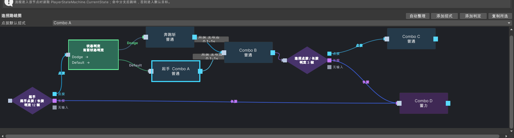
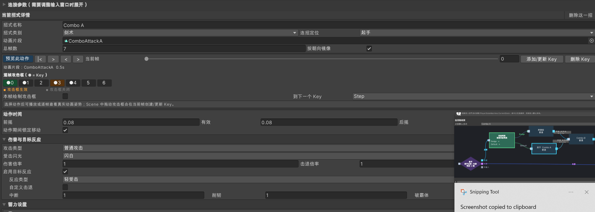
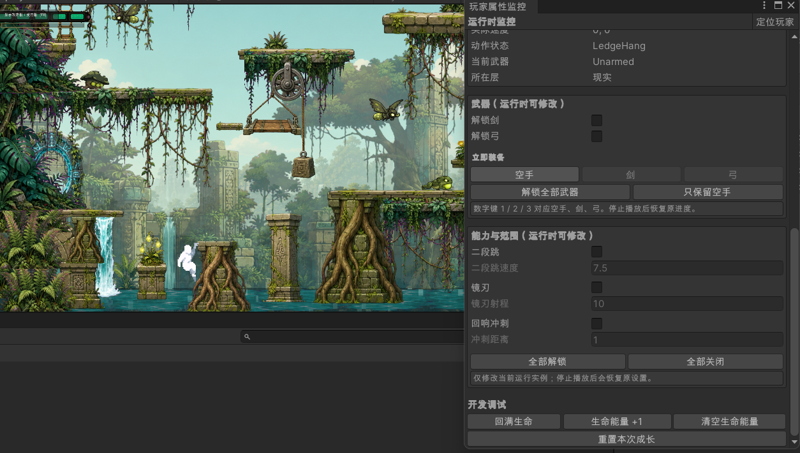
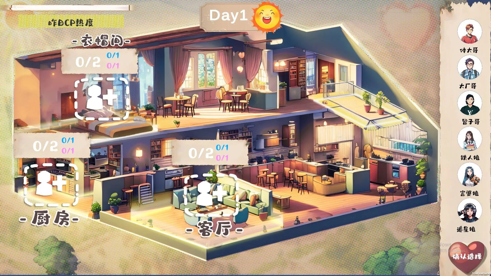

# Sherlock Zhang｜技术策划作品集

聚焦技术策划、AI 游戏与纯游戏设计。通过内容编辑工具、运行时调试与 NPC 任务设计，展示游戏系统从配置到执行的过程。

## 项目导航

| 项目 | 重点内容 | 详情 |
| --- | --- | --- |
| 类银项目 | 技能帧、连招分支、剧情校验、运行时监控 | [阅读源码核实后的案例](docs/mirror.md) |
| 模拟经营 AI NPC | 自然语言任务、规则执行与异常处理设计 | [阅读案例与实现边界](docs/ai-npc.md) |
| 历史科普类游戏 | 接入 AI 的游戏项目 | [项目说明](docs/history.md) |
| 心动制作坊 | 恋爱综艺模拟器，合作游戏项目 | [项目介绍](docs/director-game.md) |
| 上帝模拟器 | 模拟经营游戏 | [游戏录像](模拟经营/Recording%202026-09-17%20135614.mp4) |

## 1. 技术策划经验

### [类银项目](https://github.com/SherlockZhang093/mirror_test)

围绕游戏内容生产与运行调试搭建的技术策划工具，包括：

- **技能编辑器**：用于配置技能逻辑、参数与表现。
- **剧情编辑器**：用于组织剧情流程、节点与对话内容。
- **运行时监控**：用于观察运行状态、定位问题并辅助调试。

#### 技能与连招配置

将招式参数与接续条件放入可视化编辑流程。招式可以独立配置伤害、击退、动画速度和蓄力参数；连线表达输入条件、接续窗口与命中要求，判定节点区分点按、长按、无输入以及当前玩家状态。

蓄力方案在同一段动作中完成播放、定格与释放，动画驱动提供暂停与恢复能力。当前源码包含按帧配置与旧字段兼容，详细说明见案例页。

**连招演示**

https://github.com/user-attachments/assets/da3c7f2d-734f-46a3-a2cc-a0d9e541e4be

**蓄力演示**

https://github.com/user-attachments/assets/967ebe28-f708-46f8-8696-65d78ccb1019

[下载连招原文件](类银/连招.mp4) · [下载蓄力原文件](类银/蓄力.mp4)

#### 剧情编辑与运行时调试

剧情编辑器提供段落与触发器编辑、保存和校验入口；校验器检查重复或缺失 ID、空步骤、缺失镜头/引导目标和中文字体问题。

玩家监控窗口提供状态观察、武器与能力调整、恢复生命等入口，用于辅助运行时调试。

[详细案例与源码定位](docs/mirror.md)

## 2. AI 相关游戏

### [模拟经营 AI NPC](https://github.com/SherlockZhang093/harvest2)

包含 AI NPC 相关设计与实现，探索 AI 驱动角色在游戏世界中的互动与行为。

设计流程将玩家自然语言与游戏状态整理为输入，经决策接口形成结构化任务，再由游戏检查格式、资源、目标与时效，交给任务调度和 NPC 执行层处理。

农活规则考虑收获、除草、浇水和播种，并结合饥饿、口渴、体力与作息管理持续任务。

展开完整任务流程图

[观看 AI NPC 录屏](AI%20npc/简单录屏.mp4) · [详细案例](docs/ai-npc.md)

【模拟经营 AI NPC｜游戏项目演示】 https://www.bilibili.com/video/BV1S3ei6gEt1/?share_source=copy_web&vd_source=927dbe0f9ab4255be98817882bfdf8b9

现有流程图标注了本地指令模拟器与预留 API 接口，实际模型接入状态需按演示版本核实。

### 历史科普类游戏

接入 AI 能力的游戏实践，使用 `history2` 作为作品入口。相关仓库为私有，访问需要相应权限。

[项目仓库：history2](https://github.com/SherlockZhang093/history2) · [项目说明](docs/history.md)

## 3. 纯游戏设计

### 心动制作坊｜恋爱综艺模拟器

[项目仓库（Ljy-0827/DirectorGame）](https://github.com/Ljy-0827/DirectorGame) · [游戏录屏](恋爱制作人/恋爱制作人录屏.mp4)

沉浸式角色扮演模拟经营游戏。玩家扮演濒临破产的恋综导演，倾尽所有制作新节目，体验从幕后策划到台前执导的过程。

**挑选嘉宾 → 安排日程 → 选择片段 → 剪辑节目 → 争取更高收视率。**

玩家通过角色搭配和节目制作，把握角色间的化学反应与情感波动，选择呈现爱情故事或戏剧冲突，争取事业翻盘。

[详细项目介绍](docs/director-game.md)

### 上帝模拟器｜模拟经营

模拟经营游戏项目（CardPlaceGame），与“模拟经营 AI NPC”分别展示。以下录屏展示现有游戏版本。

**[观看或下载上帝模拟器游戏录屏](模拟经营/Recording%202026-09-17%20135614.mp4)**

bilibili录屏：https://www.bilibili.com/video/BV1Quei6rELq/?share_source=copy_web&vd_source=927dbe0f9ab4255be98817882bfdf8b9

当前先收录已提供的完整演示，具体玩法规则、项目仓库与个人分工后续补充。

### [清华大学 IMDT 复试作品集](https://github.com/SherlockZhang093/-)

早期作品资料入口，具体内容与个人贡献待逐项整理。

## 4. 工具与资料

- [TD-AI-guide](https://github.com/SherlockZhang093/TD-AI-guide)
- [战斗截图与录像](类银/)
- [AI NPC 流程图与录像](AI%20npc/)
- [模拟经营录像](模拟经营/)
- [心动制作坊截图与录像](恋爱制作人/)

视频使用 Git LFS 存储。若页面无法预览，可进入文件页下载；命令行克隆后运行 `git lfs pull` 获取完整视频。

## 关于作品说明

本页集中展示五个项目及已有图片、视频。Mirror 的技术说明经过本地源码静态核查；AI NPC 流程说明依据已有设计图；心动制作坊的玩法介绍依据作者提供的说明。各项目的个人职责、团队信息与量化成果仍待补充。

---

> 作品集将随项目进展持续更新。
